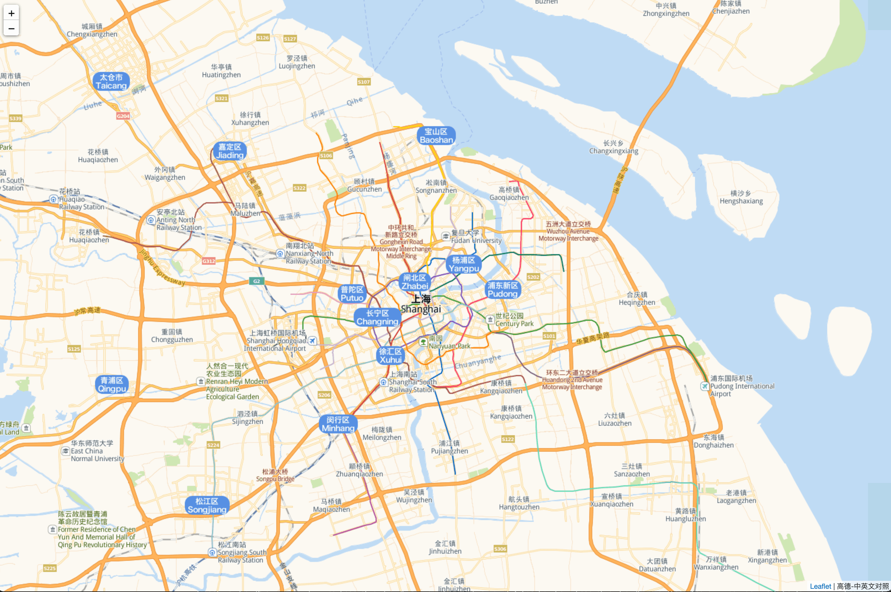
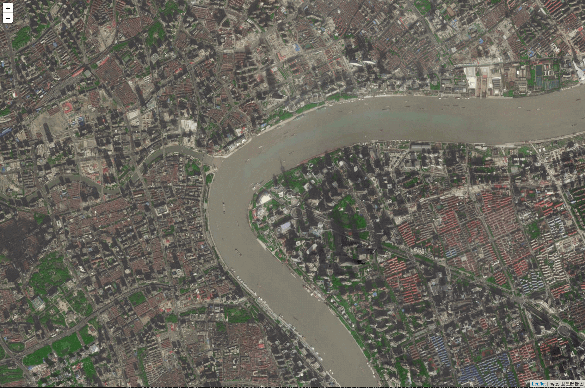
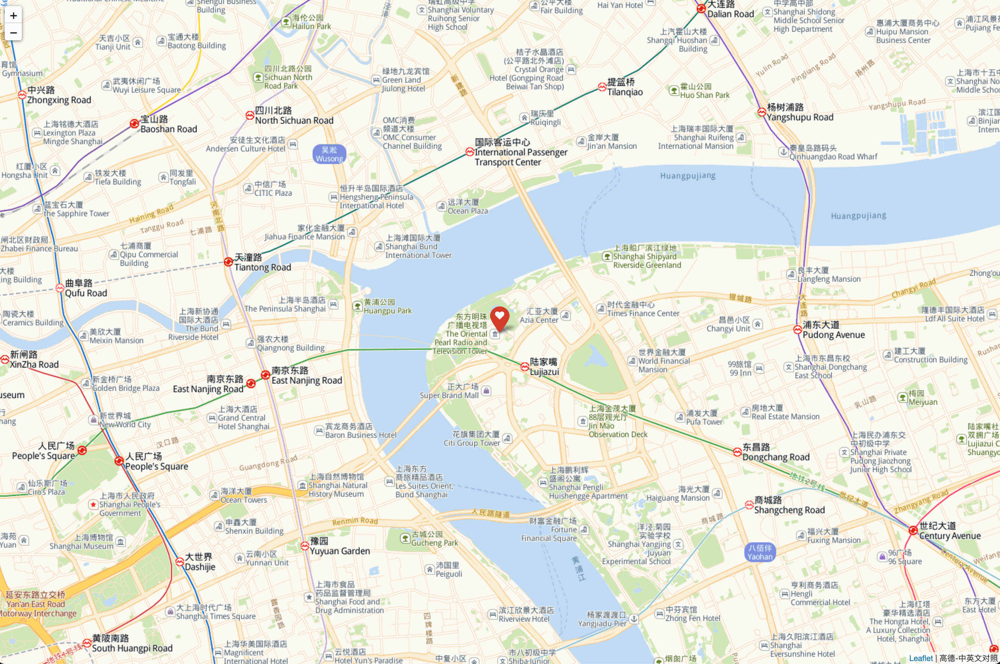
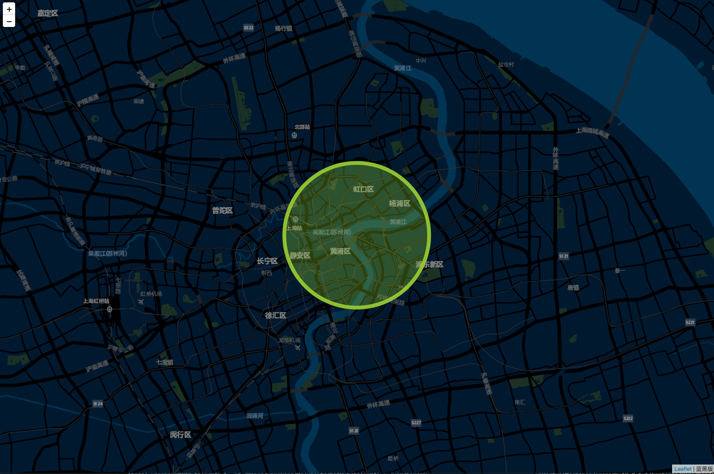
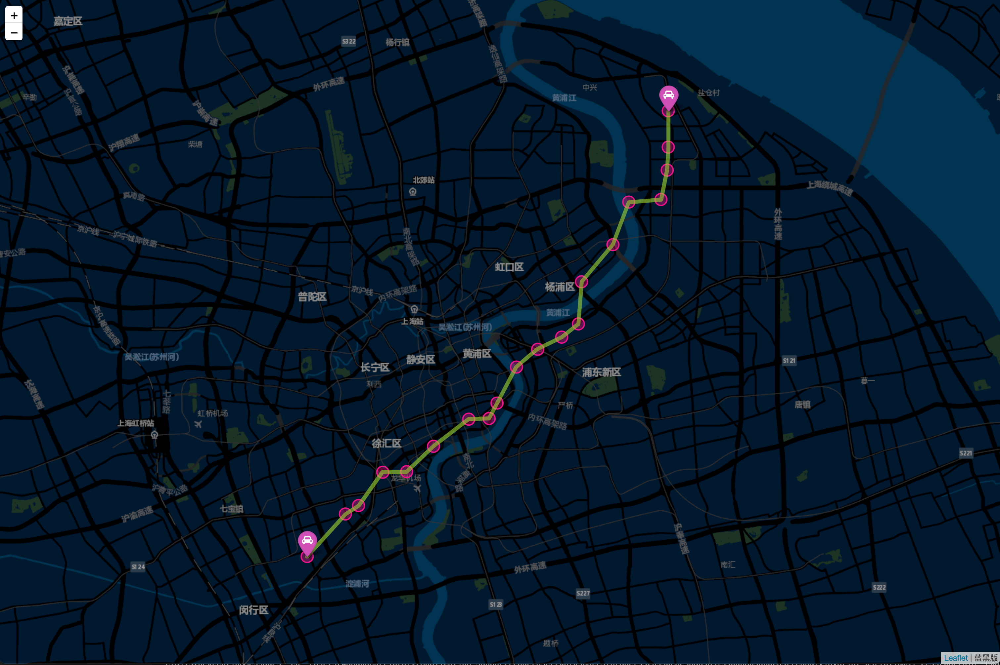

# folium4j
folium map library in Java


### Java Leaflet.js Maps, enjoy it just like folium

folium4j is writen in Java mapping strengths of the Leaflet.js library. Manipulate your data in Java, then visualize it in a Leaflet map via folium4j.

### Easy to import

Copy ```folium4j``` folder to your project as your like, import libraries as below:

```java
import folium4j.GeoMap;
import folium4j.GeoPoint;
import folium4j.GeoMap.MapStyle;
``` 

### Easy to use

#### 1. How to visualize map

```java
GeoPoint orientalPearlTower = new GeoPoint(31.24,121.50);
GeoMap map = new GeoMap(orientalPearlTower, 11, MapStyle.ChineseEnglish);
map.visualize("map.html");
```


#### 2. How to change map style

- Default
- Satellite
- ChineseEnglish
- Grayscale
- Darkblue

```java
GeoPoint orientalPearlTower = new GeoPoint(31.24,121.50);
GeoMap map = new GeoMap(orientalPearlTower, 15, MapStyle.Satellite);
map.visualize("map.html");
```


#### 2. How to add marker on map

```java
GeoPoint orientalPearlTower = new GeoPoint(31.24,121.50);
GeoMap map = new GeoMap(orientalPearlTower, 12, MapStyle.ChineseEnglish);
map.drawMarker(orientalPearlTower, "The Oriental pearl tower", "heart", "white", "red");
map.visualize("map.html");
```


#### 3. How to draw circle on map

```java
GeoPoint orientalPearlTower = new GeoPoint(31.24,121.50);
GeoMap map = new GeoMap(orientalPearlTower, 12, MapStyle.Darkblue);
map.drawCircle(orientalPearlTower, 5000, 8, "#9ACD32", 0.9, true, "#9ACD32", 0.28, "The Oriental pearl tower");
map.visualize("map.html");
```


#### 4. How to draw trajectory on map

```java
map = new GeoMap(orientalPearlTower, 12, MapStyle.Darkblue);

List<GeoPoint> points = new ArrayList<GeoPoint>();
double latitude_offset = -0.1;
double longitude_offset = -0.1;
for (int i = 0; i < 20; i++) {
    GeoPoint point = new GeoPoint(orientalPearlTower.latitude+latitude_offset, orientalPearlTower.longitude+longitude_offset);
    points.add(point);
    latitude_offset += (0.01 + 0.02*(Math.random()-0.5));
    longitude_offset += (0.01 + 0.02*(Math.random()-0.5));
    map.drawCircle(point, 280, 2, "#FF1493", 0.9, true, "#FF1493", 0.32, null);
}
map.drawPolyline(points, "#9ACD32", 0.6, 3);
    
map.visualize("map.html");
```
